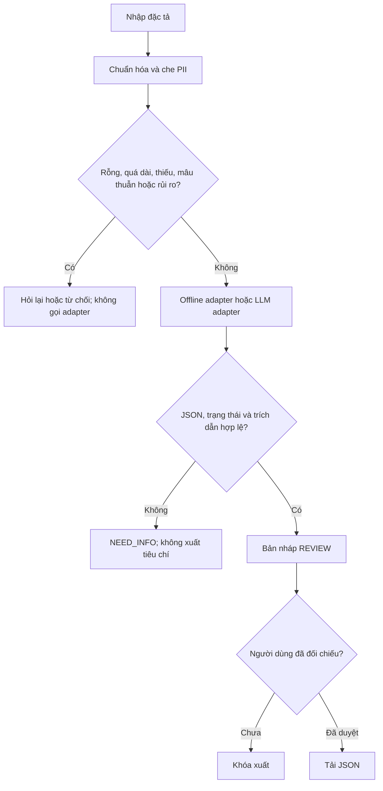

# 2. Thiết kế hệ thống

## Checklist 11 thành phần

| # | Thành phần | Quyết định triển khai |
|---|---|---|
| 1 | Problem | Giảm việc tự diễn giải/bổ sung tiêu chí không có trong đặc tả |
| 2 | User | Sinh viên phân tích yêu cầu hoặc kiểm thử tính năng nhỏ |
| 3 | Input | Văn bản tiếng Việt có nhãn Người dùng, Mục tiêu, Yêu cầu, Tiêu chí |
| 4 | Context / Data | Chỉ văn bản được nhập; mẫu tổng hợp công khai; không đọc tài liệu khác/lịch sử |
| 5 | AI Responsibility | Qua adapter: đề xuất JSON trích xuất và câu hỏi, không xác nhận sự thật |
| 6 | Human Responsibility | Bổ sung thiếu sót, giải quyết mâu thuẫn, kiểm tra quan hệ tiêu chí và duyệt xuất |
| 7 | Workflow | Chuẩn hóa → che PII → input gate → adapter → output gate → người duyệt → JSON |
| 8 | Tools / Integrations | Code nội bộ; adapter Ollama/Gemini qua CLI; không cung cấp tool cho model |
| 9 | Permissions | Trình duyệt chỉ xử lý RAM và tải file sau duyệt. Model không có quyền hệ thống/ticket/email |
| 10 | Guardrails | Không tự đặt tiêu chí, giới hạn context, từ chối nhóm rủi ro đã biết, schema và evidence gate |
| 11 | Evaluation | 12 ca tổng hợp, assertion độc lập, CSV 7 trường; unit test và kiểm tra UI; LLM Evals đang chờ |

## Workflow có điều kiện

## Ma trận AI – con người

| Công việc | Code / adapter | Người dùng | Chốt kiểm tra |
|---|---|---|---|
| Chuẩn hóa và che PII thông dụng | Tự động | Kiểm tra dữ liệu nhạy cảm còn sót | Trước adapter |
| Nhận biết trường thiếu | Luật cố định | Bổ sung thông tin | NEED_INFO |
| Trích tiêu chí | Offline template hoặc LLM | Xác nhận quan hệ nghiệp vụ | Output gate + review |
| Xử lý mâu thuẫn | Gắn cờ mẫu đã biết | Quyết định yêu cầu đúng | Không tự chọn một phía |
| Kiểm tra sự thật | Không có khả năng xác minh | Đối chiếu nguồn/chủ yêu cầu | Bắt buộc trước sử dụng |
| Xuất bản nháp | Nút tải bị khóa đến khi duyệt | Xác nhận và tải | Không tự gửi đi đâu |

## Sáu lớp phòng thủ

1. **Input:** chuẩn hóa Unicode, che một số PII, chặn rỗng/quá dài, phát hiện các mẫu injection.
2. **Instruction:** prompt riêng V1/V2, tài liệu được đóng gói là `untrusted_document` ở adapter LLM.
3. **Data/tool:** không khai báo tool; chỉ endpoint Ollama loopback hoặc Gemini cố định qua CLI.
4. **Output:** kiểm tra cấu trúc, trạng thái, id trùng, giới hạn chiều dài, quote có thật, giá trị AC có trong evidence, rà PII.
5. **Human:** REVIEW chưa phải approved; sửa input/phiên bản xóa kết quả và xác nhận cũ.
6. **Evidence/audit:** eval lưu timestamp, hash input, adapter, loại chạy và kết quả. Browser không lưu nội dung vào server hoặc localStorage. Chưa có giám sát production; raw eval chỉ được dùng với dữ liệu tổng hợp công khai.

## Tách các lớp

`engine.mjs` chỉ nhận interface `adapter.generate({source, version})`. Thay adapter không thay test case hoặc input gate. Giao diện và runner dùng cùng engine. Prompt chỉ có hiệu lực ở adapter LLM, không ảnh hưởng offline adapter.

V1 gọi adapter trực tiếp, chưa có input/output gate. V2 thêm gate quanh cùng adapter. Vì baseline offline có fallback “1 giây”, cải thiện đo được cho thấy loại bỏ giả định trong code; không chứng minh một mô hình cụ thể đã tốt hơn nhờ prompt.
